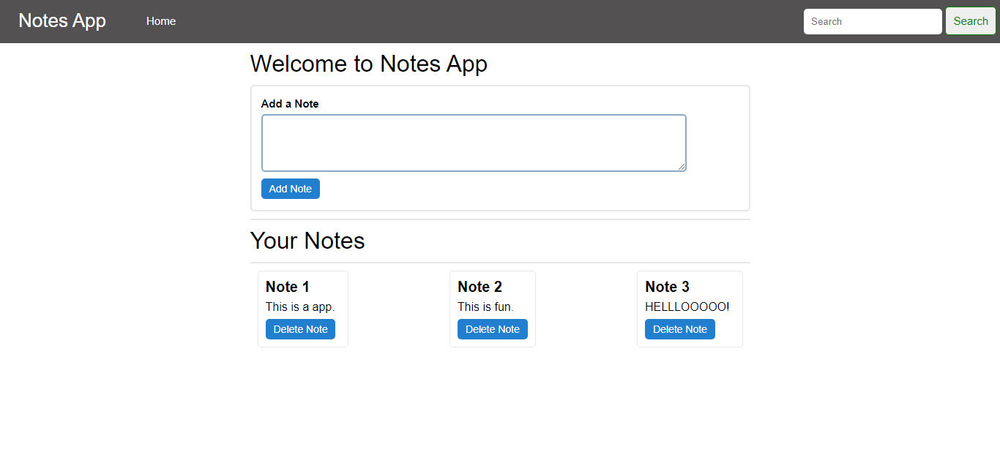

# Notes Keeping App 📝



*This app allows you to create your own notes and save them in the local storage, ensuring they persist even after a page reload. Notes can be deleted using the delete button.*

> **Used Technologies:**
- HTML
- CSS
- JavaScript

## 🛠️ How to Get Started

1. **Clone the repository**
   ```bash
   git clone https://github.com/yashpatil-1/Add_Notes_Web.git
   cd Add_Notes_Web
   ```
2. **Open the `index.html` file** in a web browser.
3. Start adding your notes!

## 📂 Features
- Add new notes
- Save notes locally (persistent storage)
- Delete notes when needed

## 📈 Demo
*(Include a screenshot or GIF showcasing the app in action)*

## 🔧 Contributing
If you'd like to contribute, feel free to **fork** the repository and submit a **pull request**.

## 📞 Contact
For any inquiries, reach out via **[workwithme.3215@gmail.com](mailto:workwithme.3215@gmail.com)** or visit my **[GitHub Profile](https://github.com/yashpatil-1)**.

---
Enjoy taking notes with **"Notes Keeping App"**! 📚
